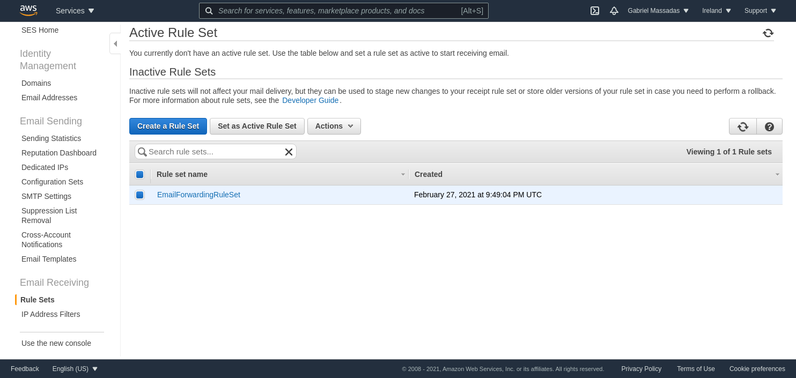

# AWS SAM Receive And Forward Emails with SES
This Sam comfig allows you to receive and forward emails using AWS SES.

This works trough a configuration file, stored in a S3 bucket, and it allows you to define multiple mappings for
your emails addresses.

## Installation
### Using the template
This repository is a Github Template, so in order to use it, just click the Green button on top that says [Use This Template](https://github.com/G4brym/AWS-SAM-receive-and-forward-emails/generate).

You need to generate a project from this template, because this is where you will save you mapping configurations and you deploying configuration.

### Deploying
The first thing you need to do in order to use this template is to install [AWS SAM](https://docs.aws.amazon.com/serverless-application-model/latest/developerguide/serverless-sam-cli-install.html).

After you have cloned the repository that you have just created, just run `make first-deploy`.

The sam cli will ask you some questions, you can leave the `SentrDsn` empty to disable it.
Make sure you enable the `Save arguments to configuration file`.

### Uploading your mapping configuration
Then, setup your forwarding configuration in this file `events/forward_mapping.json`.

And when you are done editing, just run `make config-sync S3BucketName=your-bucket-name` to upload your configuration to S3.

### Setup SES Email Receiving
After the stack is deployed, you can head up to the SES dashboard and then to the Rule Sets (Under the Email receiving section).
Select your newly created Rule Set, named `EmailForwardingRuleSet` and click `Set as Active Rule Set`.



### Committing the configurations
After everything is done, just commit your changes to both the `forwarding_mapping.json` and `samconfig.toml`.


## Maintenance
When you need to update your Forwarding mapping, just clone you previously created repository, change the `forwarding_mapping.json`
and run the `make config-sync S3BucketName=your-bucket-name` again.

## Upgrading the lambda functions
If you made some changes to the lambda code or anything else, you can just run the `make deploy`
to make subsequent deploys.

## Limitations
Because AWS SEs only allows you to send emails with verified domains, the lambda code changes the `From` address
when forwarding the message, but it also defines the `Reply-To` in the emails, for when you click the reply in
your gmail, the gmail will automatically set the email to the correct domain.

## Configuration example
```json
{
  "unprocessed_path":"queue",
  "from_email":"noreply@yourdomain.com",
  "receipt_fallback":"fallback@yourdomain.com",
  "mapping":{
    "@yourdomain.com":[
      "personal@gmail.com"
    ],
    "ceo@yourdomain.com":[
      "joe@gmail.com"
    ]
  }
}

```

